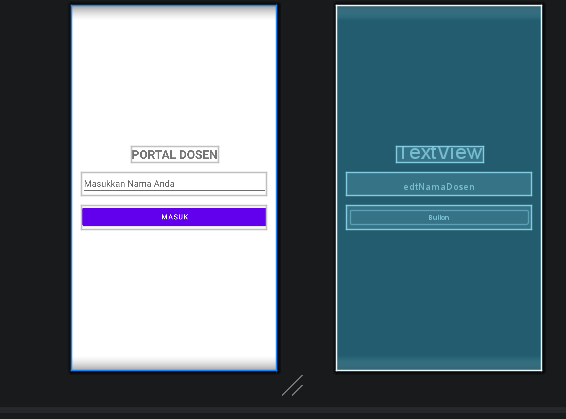
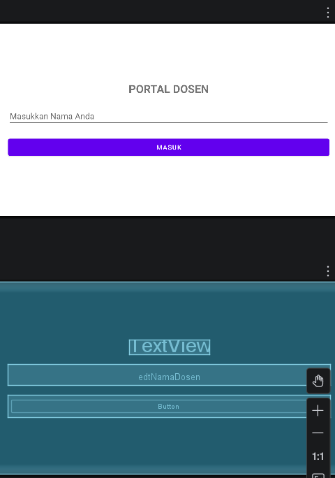
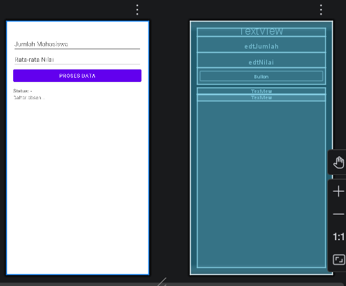
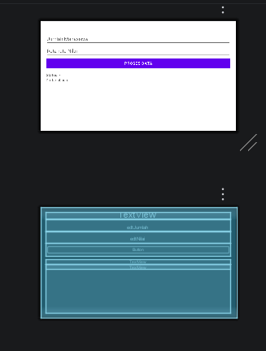

# UTS Pemrograman Seluler - Aplikasi Generator Lembar Penilaian

## Identitas Mahasiswa
- **Nama Lengkap:** Yohana Imanuel
- **NIM:** 42430049
- **Program Studi:** Computer Science

## Deskripsi Aplikasi
Aplikasi ini dibangun untuk memenuhi Ujian Tengah Semester (UTS) mata kuliah Pemrograman Seluler, meliputi:
1. **Desain UI/UX:** Layout Responsif (beradaptasi saat Portrait dan Landscape).
2. **Navigasi Multi-layar:** Menggunakan Intent untuk mengirim data ke halaman panel.
3. **Control Flow:** Implementasi If-Else untuk status kelas dan For Loop untuk daftar absen.

## Screenshot Aplikasi

### 1. Halaman Login (Responsif)
| Mode Portrait | Mode Landscape |
| :---: | :---: |
|  |  |

### 2. Halaman Panel Generator (Responsif)
| Mode Portrait | Mode Landscape |
| :---: | :---: |
|  |  |
